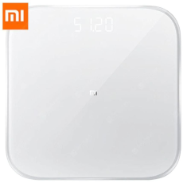
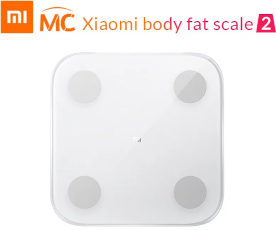
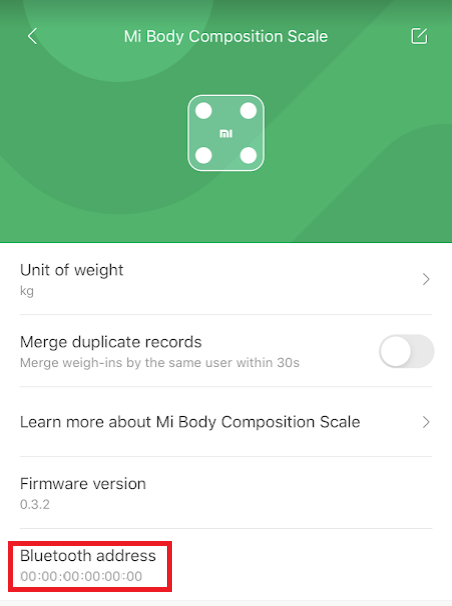
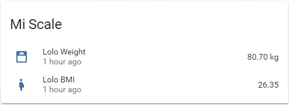

# Xiaomi Mi Scale

Code to read weight measurements from Xiaomi Body Scales.

## BREAKING CHANGE:
Please note there was a breaking change in 0.1.8. The MQTT message json attributes are now in lower snake_case to be compliant with Home-Assistant Attributes.
This means Home-Assistant sensor configuration needs to be adjusted.
For example 
`value_template: "{{ value_json['Weight'] }}"`
Needs to be replaced with
`value_template: "{{ value_json['weight'] }}"`
(note the lowercase `w` in `weight`)

## Supported Scales:
Name | Model | Picture
--- | --- | :---:
[Mi Smart Scale 2](https://www.mi.com/global/scale) &nbsp; &nbsp; &nbsp; &nbsp; &nbsp; &nbsp; &nbsp; &nbsp; &nbsp; &nbsp; &nbsp; &nbsp; &nbsp; &nbsp; &nbsp; &nbsp; &nbsp; &nbsp; &nbsp; &nbsp; &nbsp; &nbsp; &nbsp; &nbsp; &nbsp; &nbsp; &nbsp; &nbsp; &nbsp; &nbsp; &nbsp; &nbsp; &nbsp; &nbsp; &nbsp; &nbsp; &nbsp; &nbsp; &nbsp; &nbsp; &nbsp; &nbsp; &nbsp; &nbsp; &nbsp; &nbsp; &nbsp; | XMTZCO1HM, XMTZC04HM | 
[Mi Body Composition Scale](https://www.mi.com/global/mi-body-composition-scale/) | XMTZC02HM | 
[Mi Body Composition Scale 2](https://c.mi.com/thread-2289389-1-0.html) | XMTZC05HM | 


## Home Assistant Add-On:
If using Home Assistant (formerly known as hass.io), try instead the [Xiaomi Mi Scale Add-On for Home Assistant](https://github.com/lolouk44/hassio-addons/tree/master/mi-scale) based on this repository.

## Getting the Mac Address of your Scale:

1. Retrieve the scale's MAC Address from the Xiaomi Mi Fit App:



## Setup & Configuration:
### Running script with Docker:

1. Supported platforms:
	1. linux/386
	1. linux/amd64
	1. linux/arm32v6
	1. linux/arm32v7
	1. linux/arm64v8
1. Open `docker-compose.yml` (see below) and edit the environment to suit your configuration...
1. Stand up the container - `docker-compose up -d`

### docker-compose:
```yaml
version: '3'
services:

  mi-scale:
    image: lolouk44/xiaomi-mi-scale:latest
    container_name: mi-scale
    restart: always

    network_mode: host
    privileged: true

    environment:
    - HCI_DEV=hci0                  # Bluetooth hci device to use. Defaults to hci0
    - MISCALE_MAC=00:00:00:00:00:00 # Mac address of your scale
    - MQTT_HOST=127.0.0.1           # MQTT Server (defaults to 127.0.0.1)
    - MQTT_PREFIX=miscale           # MQTT Topic Prefix. Defaults to miscale
    - MQTT_USERNAME=                # Username for MQTT server (comment out if not required)
    - MQTT_PASSWORD=                # Password for MQTT (comment out if not required)
    - MQTT_PORT=                    # Defaults to 1883
    - TIME_INTERVAL=30              # Time in sec between each query to the scale, to allow other applications to use the Bluetooth module. Defaults to 30
    - MQTT_DISCOVERY=true           # Home Assistant Discovery (true/false), defaults to true
    - MQTT_DISCOVERY_PREFIX=        # Home Assistant Discovery Prefix, defaults to homeassistant

      # Auto-gender selection/config -- This is used to create the calculations such as BMI, Water/Bone Mass etc...
      # Up to 3 users possible as long as weights do not overlap!


      # Here is the logic used to assign a measured weight to a user:
      # if [measured value in kg] is greater than USER1_GT, assign it to USER1
      # else if [measured value in kg] is less than USER2_LT, assign it to USER2
      # else assign it to USER3 (e.g. USER2_LT < [measured value in kg] < USER1_GT)

    - USER1_GT=70                   # If the weight (in kg) is greater than this number, we'll assume that we're weighing User #1
    - USER1_SEX=male                # male / female
    - USER1_NAME=Jo                 # Name of the user
    - USER1_HEIGHT=175              # Height (in cm) of the user
    - USER1_DOB=1990-01-01          # DOB (in yyyy-mm-dd format)

    - USER2_LT=35                   # If the weight (in kg) is less than this number, we'll assume that we're weighing User #2
    - USER2_SEX=female              # male / female
    - USER2_NAME=Serena             # Name of the user
    - USER2_HEIGHT=95               # Height (in cm) of the user
    - USER2_DOB=1990-01-01          # DOB (in yyyy-mm-dd format)

    - USER3_SEX=female              # male / female
    - USER3_NAME=Missy              # Name of the user
    - USER3_HEIGHT=150              # Height (in cm) of the user
    - USER3_DOB=1990-01-01          # DOB (in yyyy-mm-dd format)
```


### Running script directly on your host system (if your platform is not listed/supported):

**Note: Python 3.6 or higher is required to run the script manually**
1. Install python requirements (pip3 install -r requirements.txt)
1. Open `wrapper.sh` and configure your environment variables to suit your setup.
1. Add a cron-tab entry to wrapper like so:

```sh
@reboot bash /path/to/wrapper.sh
```

**NOTE**: Although once started the script runs continuously, it may take a few seconds for the data to be retrieved, computed and sent via mqtt.

## Home-Assistant Setup:
Under the `sensor` block, enter as many blocks as users configured in your environment variables:

```yaml
  - platform: mqtt
    name: "Example Name Weight"
    state_topic: "miscale/USER_NAME/weight"
    value_template: "{{ value_json['weight'] }}"
    unit_of_measurement: "kg"
    json_attributes_topic: "miscale/USER_NAME/weight"
    icon: mdi:scale-bathroom

  - platform: mqtt
    name: "Example Name BMI"
    state_topic: "miscale/USER_NAME/weight"
    value_template: "{{ value_json['bmi'] }}"
    icon: mdi:human-pregnant
    unit_of_measurement: "kg/m2"

```




## Acknowledgements:
Thanks to @syssi (https://gist.github.com/syssi/4108a54877406dc231d95514e538bde9) and @prototux (https://github.com/wiecosystem/Bluetooth) for their initial code

Special thanks to [@ned-kelly](https://github.com/ned-kelly) for his help turning a "simple" python script into a fully fledged docker container

Thanks to [@bpaulin](https://github.com/bpaulin), [@AiiR42](https://github.com/AiiR42) for their PRs and collaboration
